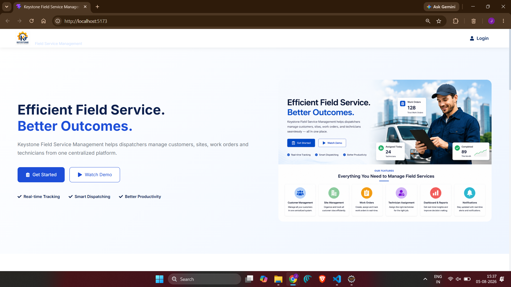
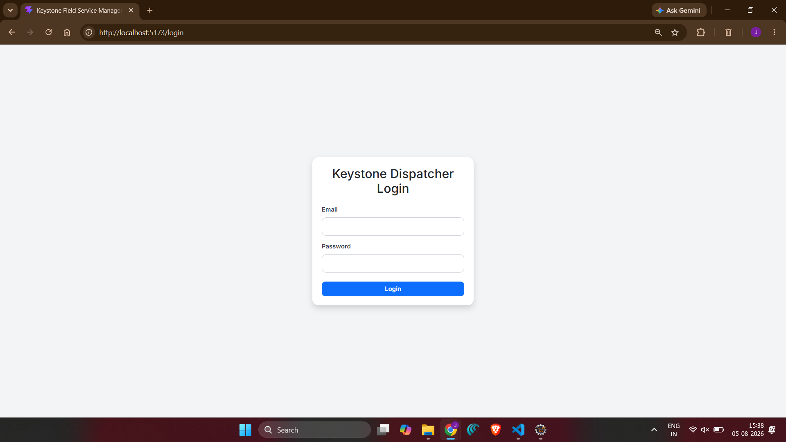
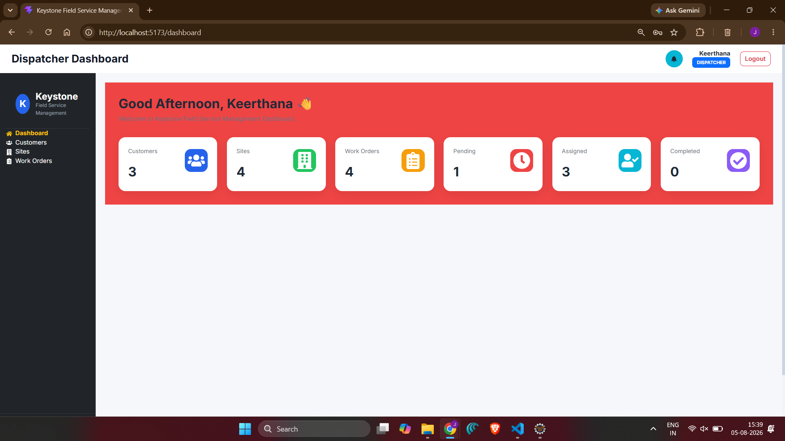
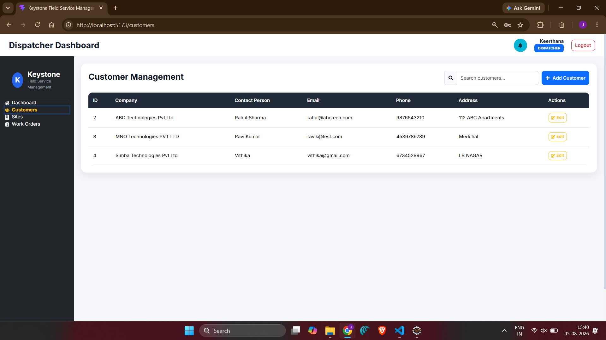
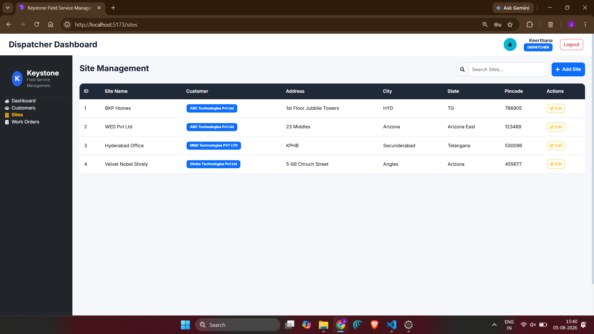

# Keystone Field Service Management System

A modern **Field Service Management System (FSM)** developed using **Spring Boot, React, TypeScript, MySQL, and JWT Authentication**. The system enables dispatchers to efficiently manage customers, service sites, work orders, and technician assignments through a secure, user-friendly web application.

---

## 📌 Project Overview

Keystone Field Service Management System is designed to simplify field service operations by providing a centralized platform for managing customers, service locations, work orders, and technician assignments. It improves operational efficiency with role-based authentication, real-time work order tracking, and an intuitive dashboard.

---

## ✨ Features

- 🔐 JWT-based Authentication
- 👥 Customer Management
- 🏢 Site Management
- 📋 Work Order Management
- 👨‍🔧 Technician Assignment
- 📊 Dashboard with Statistics
- 🔍 Search and Filtering
- 📱 Responsive User Interface
- 🎨 Modern Landing Page
- Role-based Access Control

---

## 🛠️ Technology Stack

### Frontend

- React
- TypeScript
- Vite
- Bootstrap 5
- React Router
- Axios
- React Icons
- React Toastify

### Backend

- Spring Boot
- Spring Security
- Spring Data JPA
- JWT Authentication
- Hibernate

### Database

- MySQL

---

## 📂 Project Structure

```
ZIDIOWORKSPACE
│
├── backend
│   ├── src
│   ├── pom.xml
│   └── ...
│
├── frontend
│   ├── src
│   ├── public
│   ├── package.json
│   └── ...
│
└── screenshots
```

---

## 🚀 Main Modules

- Authentication
- Dashboard
- Customer Management
- Site Management
- Work Order Management
- Technician Assignment

---

### 📸 Application Screenshots

### 🏠 Home Page



---

### 🔐 Login Page



---

### 📊 Dashboard



---

### 👥 Customer Management



---

### 🏢 Site Management



---

### 📋 Work Order Management


---

### 👨‍🔧 Technician Assignment


### Home Page

*(Add screenshot here)*

---

### Login Page

*(Add screenshot here)*

---

### Dashboard

*(Add screenshot here)*

---

### Customer Management

*(Add screenshot here)*

---

### Site Management

*(Add screenshot here)*

---

### Work Order Management

*(Add screenshot here)*

---

### Technician Assignment

*(Add screenshot here)*

---

## ⚙️ Installation

### Backend

```bash
cd backend
mvn clean install
mvn spring-boot:run
```

### Frontend

```bash
cd frontend
npm install
npm run dev
```

---

## 🔑 Default Login

| Role | Email | Password |
|------|-------|----------|
| Dispatcher | dispatcher@example.com | ****** |

*(Update with your actual credentials if appropriate.)*

---

## 🔮 Future Enhancements

- Email Notifications
- SMS Alerts
- Technician Mobile App
- GPS Tracking
- Analytics Dashboard
- PDF Report Generation
- Multi-Organization Support

---

## 👨‍💻 Developer

**Keerthana Jangam**

B.Tech – Computer Science Engineering

---

## 📄 License

This project was developed for academic and learning purposes.